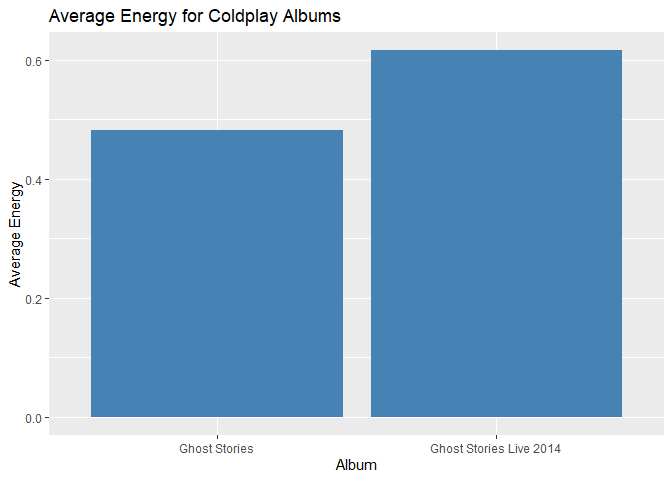
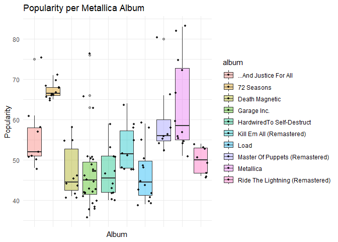
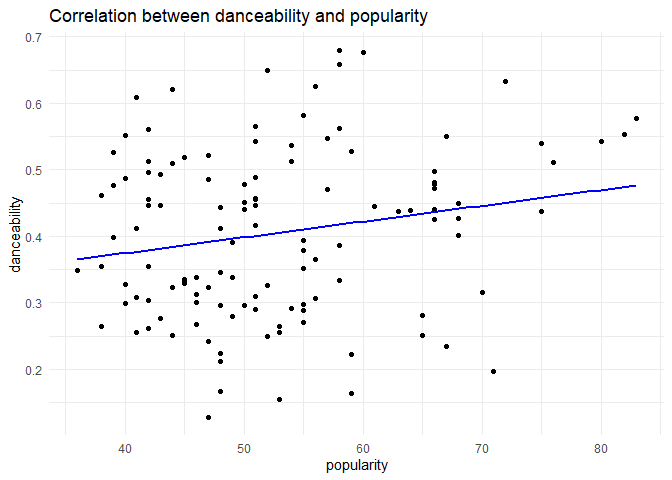
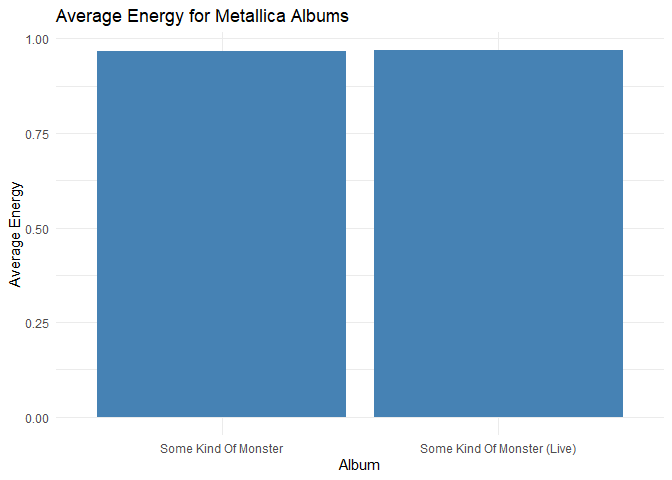
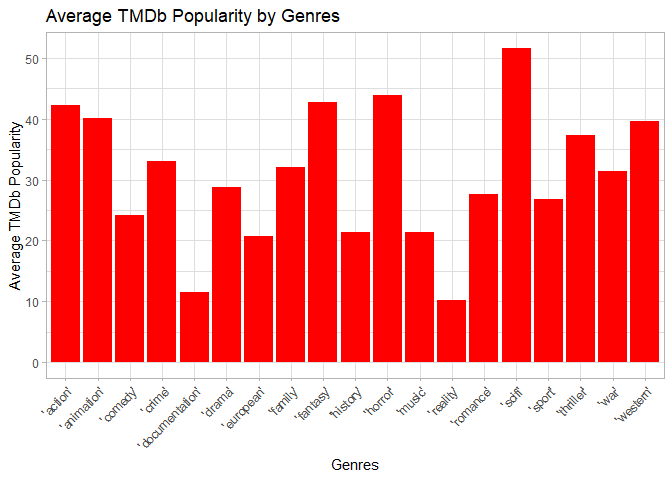
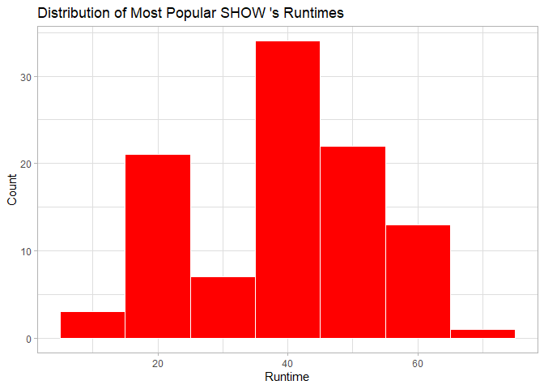
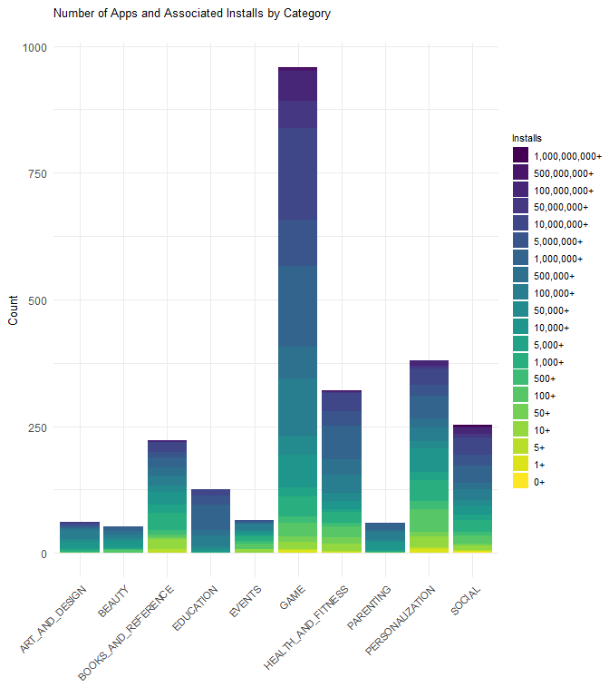

# Hannah’s Data Science Exam

The purpose of this ReadMe is to show my output and thinking from each
question.

``` r
rm(list = ls()) # Clean your environment:
gc() # garbage collection - It can be useful to call gc after a large object has been removed, as this may prompt R to return memory to the operating system.
```

    ##          used (Mb) gc trigger (Mb) max used (Mb)
    ## Ncells 466913 25.0    1003842 53.7   660388 35.3
    ## Vcells 865630  6.7    8388608 64.0  1769776 13.6

``` r
suppressMessages(library(tidyverse))
suppressMessages(list.files('code/', full.names = T, recursive = T) %>% .[grepl('.R', .)] %>% as.list() %>% walk(~source(.)))
```

# Question 1

In Question 1, COVID-19 cases and vaccinations are plotted across
continents to display the differences between Africa and other
continents. Secondly, to look at specific countries, the severity of the
virus is examined in high and low life expectancy countries. General
Hospitalisations and ICU admissions are plotted for continents and
globally.

``` r
suppressMessages(owid_covid_data <- read_csv("Q1/data/owid-covid-data.csv"))
source("Q1/code/plot_covid_and_vaccination.R")
plots <- plot_covid_and_vaccination(owid_covid_data)
```

    ## `summarise()` has grouped output by 'date'. You can override using the
    ## `.groups` argument.
    ## `summarise()` has grouped output by 'date'. You can override using the
    ## `.groups` argument.

``` r
plots$plot_cases  # Figure 1: Average COVID-19 Cases per Million by Continent over Time
```

    ## Warning: Removed 101 rows containing missing values (`geom_line()`).

<!-- -->

``` r
plots$plot_vaccinations  # Figure 2: Average Fully Vaccinated per Hundred
```

    ## Warning: Removed 2463 rows containing missing values (`geom_line()`).

<!-- -->

``` r
suppressMessages(Deaths_by_cause <- read_csv("Q1/data/Deaths_by_cause.csv"))
combined_data <- bind_rows(owid_covid_data, Deaths_by_cause)

lowest_le <- combined_data %>%
filter(location %in% c("Chad", "Lesotho", "Central African Republic", "Nigeria", "Sierra Leone"))
Total_Deaths <- lowest_le$total_deaths

source("Q1/code/plot_lowest_le.R")
p <- plot_lowest_le(lowest_le, Total_Deaths, "Total Deaths over Time in Regions with Lowest LE")
p
```

    ## Warning: Removed 213 rows containing missing values (`geom_line()`).

<!-- -->

``` r
highest_le <- combined_data %>%
filter(location %in% c("Hong Kong", "Japan", "Macao", "Monaco", "San Marino"))
Total_deaths <- highest_le$total_deaths
q <- plot_lowest_le(highest_le, Total_deaths, "Total Deaths over Time in Regions with Highest LE")
q
```

    ## Warning: Removed 939 rows containing missing values (`geom_line()`).

<!-- -->

``` r
lowest_le <- combined_data %>%
filter(location %in% c("Chad", "Lesotho", "Central African Republic", "Nigeria", "Sierra Leone"))
Total_Cases_per_Million <- lowest_le$total_cases_per_million
r <- plot_lowest_le(lowest_le, Total_Cases_per_Million, "Total Cases per Million over Time in Regions with Lowest LE")
r
```

<!-- -->

``` r
Total_cases_per_Million <- highest_le$total_cases_per_million

s <- plot_lowest_le(highest_le, Total_cases_per_Million, "Total Cases per Million over Time in Regions with Highest LE")
s
```

<!-- -->

``` r
filtered_data <- combined_data %>%
  filter(continent %in% c("Africa", "North America", "South America", "Asia", "Europe"))
source("Q1/code/plot_filtered_data.R")
hosp <- plot_filtered_data(filtered_data, weekly_hosp_admissions_per_million, "Weekly Hospital Admissions Per Million", "Weekly Hospital Admissions among Continents")
hosp
```

    ## Warning: Removed 157590 rows containing missing values (`geom_bar()`).

<!-- -->

``` r
icu <- plot_filtered_data(filtered_data, weekly_icu_admissions_per_million, "Weekly ICU Admissions Per Million", "Weekly ICU Admissions among Continents")
icu
```

    ## Warning: Removed 163863 rows containing missing values (`geom_bar()`).

<!-- -->

``` r
source("Q1/code/plot_hospital_icu_data.R")
globalp <- plot_hospital_icu_data(combined_data, hosp_patients, icu_patients)
suppressWarnings(globalp)
```

    ## Warning: Removed 7332 rows containing missing values (`geom_line()`).

    ## Warning: Removed 8762 rows containing missing values (`geom_line()`).

<!-- -->

# Question 2

In Question 2, London’s weather is first examined, looking at monthly
precipitation, cloudiness and coldness from 2019. Descriptive tables of
weather trends are also provided.

The general UK weather is then examined, plotting average temperature
and number of Heating Days per year since the 1880s.

For London

``` r
suppressMessages(london_weather <- read_csv("Q2/data/london_weather.csv"))
london_weather$date <- as.character(london_weather$date)
london_weather$date <- as.Date(london_weather$date, format = "%Y%m%d")
london <- na.omit(london_weather)
london$month <- format(london$date, "%Y-%m")
london_filtered <- london[london$date >= as.Date("2019-01-01"), ]

monthly_precipitation <- london_filtered %>%
  group_by(month) %>%
  summarize(total_precipitation = sum(precipitation, na.rm = TRUE))

monthly_cloudy <- london_filtered %>%
  group_by(month) %>%
  summarize(avg_cloud = mean(cloud_cover, na.rm = TRUE))

monthly_min_temp <- london_filtered %>%
  group_by(month) %>%
  summarize(min_temp = min(min_temp, na.rm = TRUE))

source("Q2/code/plot_monthly_data.R")
precip <- plot_monthly_data(monthly_precipitation, total_precipitation, " Total Precipitation")
precip
```

<!-- -->

``` r
source("Q2/code/plot_monthly_data.R")
cloud <- plot_monthly_data(monthly_cloudy, avg_cloud, "Average Cloudiness")
cloud
```

<!-- -->

``` r
source("Q2/code/plot_monthly_data.R")
cold <- plot_monthly_data(monthly_min_temp, min_temp, "Average Minimum Temp")
cold
```

<!-- -->

``` r
library(dplyr)
library(knitr)
library(kableExtra)
```

    ## 
    ## Attaching package: 'kableExtra'

    ## The following object is masked from 'package:dplyr':
    ## 
    ##     group_rows

``` r
london$year <- lubridate::year(london$date)
source("Q2/code/generate_summary_stats.R")

summary_stats <- london %>% filter(london$date >= as.Date("2015-01-01"), ) %>%  group_by(year) %>%
  summarize(
    min_temp = min(min_temp, na.rm = TRUE),
    max_temp = max(max_temp, na.rm = TRUE),
    avg_temp = mean(mean_temp, na.rm =TRUE)


  )


kable(summary_stats, caption = "Stats Table", align = "c") %>%
    kable_styling()
```

<table class="table" style="margin-left: auto; margin-right: auto;">
<caption>
Stats Table
</caption>
<thead>
<tr>
<th style="text-align:center;">
year
</th>
<th style="text-align:center;">
min_temp
</th>
<th style="text-align:center;">
max_temp
</th>
<th style="text-align:center;">
avg_temp
</th>
</tr>
</thead>
<tbody>
<tr>
<td style="text-align:center;">
2015
</td>
<td style="text-align:center;">
-5.9
</td>
<td style="text-align:center;">
36.7
</td>
<td style="text-align:center;">
12.13416
</td>
</tr>
<tr>
<td style="text-align:center;">
2016
</td>
<td style="text-align:center;">
-4.6
</td>
<td style="text-align:center;">
33.2
</td>
<td style="text-align:center;">
11.90137
</td>
</tr>
<tr>
<td style="text-align:center;">
2017
</td>
<td style="text-align:center;">
-4.5
</td>
<td style="text-align:center;">
34.5
</td>
<td style="text-align:center;">
12.07750
</td>
</tr>
<tr>
<td style="text-align:center;">
2018
</td>
<td style="text-align:center;">
-5.4
</td>
<td style="text-align:center;">
35.0
</td>
<td style="text-align:center;">
12.52932
</td>
</tr>
<tr>
<td style="text-align:center;">
2019
</td>
<td style="text-align:center;">
-5.2
</td>
<td style="text-align:center;">
37.9
</td>
<td style="text-align:center;">
12.19397
</td>
</tr>
</tbody>
</table>

``` r
source("Q2/code/generate_summary_stats_extra.R")
summary_stats_sun <- london %>% filter(london$date >= as.Date("2015-01-01"), ) %>%  group_by(year) %>%
  summarize(
    sunshine_mean = mean(sunshine, na.rm = TRUE),
    cloud_cover_mean = mean (cloud_cover, na.rm = TRUE),
    precipitation_mean = max(precipitation, na.rm = TRUE)
  )

kable(summary_stats_sun, caption = "Stats Table", align = "c") %>%
    kable_styling()
```

<table class="table" style="margin-left: auto; margin-right: auto;">
<caption>
Stats Table
</caption>
<thead>
<tr>
<th style="text-align:center;">
year
</th>
<th style="text-align:center;">
sunshine_mean
</th>
<th style="text-align:center;">
cloud_cover_mean
</th>
<th style="text-align:center;">
precipitation_mean
</th>
</tr>
</thead>
<tbody>
<tr>
<td style="text-align:center;">
2015
</td>
<td style="text-align:center;">
4.131956
</td>
<td style="text-align:center;">
4.771350
</td>
<td style="text-align:center;">
51.6
</td>
</tr>
<tr>
<td style="text-align:center;">
2016
</td>
<td style="text-align:center;">
4.000822
</td>
<td style="text-align:center;">
5.202740
</td>
<td style="text-align:center;">
27.0
</td>
</tr>
<tr>
<td style="text-align:center;">
2017
</td>
<td style="text-align:center;">
3.853333
</td>
<td style="text-align:center;">
5.361111
</td>
<td style="text-align:center;">
36.8
</td>
</tr>
<tr>
<td style="text-align:center;">
2018
</td>
<td style="text-align:center;">
4.670685
</td>
<td style="text-align:center;">
4.901370
</td>
<td style="text-align:center;">
31.8
</td>
</tr>
<tr>
<td style="text-align:center;">
2019
</td>
<td style="text-align:center;">
4.235890
</td>
<td style="text-align:center;">
5.054794
</td>
<td style="text-align:center;">
31.8
</td>
</tr>
</tbody>
</table>

For the UK in general

``` r
suppressMessages(UK <- read_csv("Q2/data/UKMonthly_Detailed.csv"))
UK$DATE <- as.Date(paste0(UK$DATE, "-01"), format = "%Y-%m-%d")

UK_yearly_temp <- UK %>%
  group_by(year = lubridate::year(DATE)) %>%
  summarize(average_temperature = mean(TAVG, na.rm = TRUE))

source("Q2/code/plot_yearly_data.R")
temp <- plot_yearly_data(UK_yearly_temp, average_temperature, "Average Temperature", "Yearly Average Temperature in UK")
```

    ## Warning: Using `size` aesthetic for lines was deprecated in ggplot2 3.4.0.
    ## ℹ Please use `linewidth` instead.
    ## This warning is displayed once every 8 hours.
    ## Call `lifecycle::last_lifecycle_warnings()` to see where this warning was
    ## generated.

``` r
temp
```

<!-- -->

``` r
UK_yearly_heat <- UK %>%
  group_by(year = lubridate::year(DATE)) %>% summarize(average_heat = mean(HTDD, na.rm = TRUE))

heat <- plot_yearly_data(UK_yearly_temp, average_temperature, "Average Number of Heating Days", "Yearly Average Number of Heating Days in UK")
heat
```

<!-- -->

# Question 3

In Question 3, Coldplay is examined first followed by Metallica. For
both, average danceability per album and album popularity are plotted. I
look at the correlation between danceability and popularity, finding
similar results for both. When looking at energy levels for live vs
studio albums, Coldplay gives substantially less energy in their studio
albums.

I also look at the broader music scene and find the top 10 most
danceable songs in recent history.

## Coldplay

``` r
suppressMessages(Coldplay <- read_csv("Q3/data/Coldplay.csv"))

filtered_coldplay <- subset(Coldplay, album_name %in% c("Parachutes", "A Rush of Blood to the Head", "X&Y", "Viva La Vida or Death and All His Friends", "Mylo Xyloto", "Ghost Stories", "A Head Full of Dreams", "Love in Tokyo", "Everyday Life", "Music Of The Spheres"))

average_danceability <- aggregate(danceability ~ album_name, data = filtered_coldplay, FUN = mean)

source("Q3/code/plot_average_danceability.R")
suppressWarnings(dance_coldplay <- plot_average_danceability(average_danceability, album_name))
dance_coldplay
```

<!-- -->

``` r
source("Q3/code/plot_popularity_band.R")
cold_play_plot <- plot_popularity_band(filtered_coldplay, album_name, "Popularity per ColdPlay Album")
cold_play_plot
```

<!-- -->

``` r
source("Q3/code/create_corr.R")
col <- create_corr(filtered_coldplay, popularity, danceability, "Correlation between danceability and popularity")
col
```

    ## `geom_smooth()` using formula = 'y ~ x'

<!-- -->

``` r
#Looking at Coldplay's energy live vs studio
average_energy_cold <- Coldplay %>%
  filter(album_name %in% c("Ghost Stories", "Ghost Stories Live 2014")) %>% aggregate(energy ~ album_name, ., FUN = mean)

source("Q3/code/create_bar_plot.R")
bar_plot_cold <- create_bar_plot(average_energy_cold, album_name, energy, "Album", "Average Energy", "Average Energy for Coldplay Albums")
bar_plot_cold
```

<!-- -->

## Metallica

``` r
suppressMessages(metallica <- read.csv("Q3/data/metallica.csv"))
filtered_metallica <- subset(metallica, album %in% c("72 Seasons", "Metallica", "Master Of Puppets (Remastered)", "...And Justice For All", "Kill Em All (Remastered)", "Ride The Lightning (Remastered)", "Death Magnetic", "Garage Inc.", "HardwiredTo Self-Destruct", "Load"))
average_danceability_met <- aggregate(danceability ~ album, data = filtered_metallica, FUN = mean)

dance_met <- plot_average_danceability(average_danceability_met, album)
dance_met
```

<!-- -->

``` r
met_plot <- plot_popularity_band(filtered_metallica, album, "Popularity per Metallica Album")
met_plot
```

<!-- -->

``` r
met <- create_corr(filtered_metallica, popularity, danceability, "Correlation between danceability and popularity")
met
```

    ## `geom_smooth()` using formula = 'y ~ x'

<!-- -->

``` r
average_energy <- metallica %>%
filter(album %in% c("Some Kind Of Monster", "Some Kind Of Monster (Live)")) %>% aggregate(energy ~ album, ., FUN = mean)

bar_plot_met <- create_bar_plot(average_energy, album, energy, "Album", "Average Energy", "Average Energy for Metallica Albums")
bar_plot_met
```

<!-- -->

## Broad Music Scene

``` r
suppressMessages(Broader_Spotify_Info <- read.csv("Q3/data/Broader_Spotify_Info.csv"))

top_10_dance_songs <- Broader_Spotify_Info %>%
  top_n(10, danceability) %>%
  select(name, artist, danceability) %>%
  arrange(desc(danceability))

# top 10 dancing songs
table_dance <- kable(top_10_dance_songs, row.names = TRUE,
      caption = 'Top 10 Most Danceable Songs',
      format = "html", booktabs = T) %>%
        kable_styling(full_width = T,
                      latex_options = c("striped",
                                        "scale_down",
                                        "HOLD_position"),
                      font_size = 13)
table_dance
```

<table class="table" style="font-size: 13px; margin-left: auto; margin-right: auto;">
<caption style="font-size: initial !important;">
Top 10 Most Danceable Songs
</caption>
<thead>
<tr>
<th style="text-align:left;">
</th>
<th style="text-align:left;">
name
</th>
<th style="text-align:left;">
artist
</th>
<th style="text-align:right;">
danceability
</th>
</tr>
</thead>
<tbody>
<tr>
<td style="text-align:left;">
1
</td>
<td style="text-align:left;">
Leave Me Now
</td>
<td style="text-align:left;">
Herbert
</td>
<td style="text-align:right;">
0.986
</td>
</tr>
<tr>
<td style="text-align:left;">
2
</td>
<td style="text-align:left;">
Go Girl
</td>
<td style="text-align:left;">
Pitbull
</td>
<td style="text-align:right;">
0.985
</td>
</tr>
<tr>
<td style="text-align:left;">
3
</td>
<td style="text-align:left;">
Funky Cold Medina
</td>
<td style="text-align:left;">
Tone-Lōc
</td>
<td style="text-align:right;">
0.984
</td>
</tr>
<tr>
<td style="text-align:left;">
4
</td>
<td style="text-align:left;">
State of Shock
</td>
<td style="text-align:left;">
The Jacksons
</td>
<td style="text-align:right;">
0.982
</td>
</tr>
<tr>
<td style="text-align:left;">
5
</td>
<td style="text-align:left;">
Teachers
</td>
<td style="text-align:left;">
Daft Punk
</td>
<td style="text-align:right;">
0.980
</td>
</tr>
<tr>
<td style="text-align:left;">
6
</td>
<td style="text-align:left;">
Give It To Me
</td>
<td style="text-align:left;">
Timbaland
</td>
<td style="text-align:right;">
0.975
</td>
</tr>
<tr>
<td style="text-align:left;">
7
</td>
<td style="text-align:left;">
Ice Ice Baby (Radio Edit)
</td>
<td style="text-align:left;">
Vanilla Ice
</td>
<td style="text-align:right;">
0.975
</td>
</tr>
<tr>
<td style="text-align:left;">
8
</td>
<td style="text-align:left;">
Tape Song
</td>
<td style="text-align:left;">
The Kills
</td>
<td style="text-align:right;">
0.974
</td>
</tr>
<tr>
<td style="text-align:left;">
9
</td>
<td style="text-align:left;">
Heavy Machinery
</td>
<td style="text-align:left;">
Scuba
</td>
<td style="text-align:right;">
0.973
</td>
</tr>
<tr>
<td style="text-align:left;">
10
</td>
<td style="text-align:left;">
Long Shot Kick De Bucket
</td>
<td style="text-align:left;">
The Pioneers
</td>
<td style="text-align:right;">
0.971
</td>
</tr>
</tbody>
</table>

# Question 4

Question 4 examines trends on Netflix. The top actors on Netflix
according to their average IMDb rating are found, and their frequency
across movies and series are tabled. This shows that more titles with
these well-renowned actors need to shown on Netflix.

The most popular genres are also plotted according to TMBd popularity.
Sci-Fi is the most popular, therefore Netflix should increase its Sci-Fi
titles. The average run-time for the most popular movies and shows,
respectively, is plotted to determine the optimal length of titles to
maintain viewer interest.

``` r
library(knitr)
library(kableExtra)

suppressMessages(titles <- read_csv("Q4/data/titles.csv"))
suppressMessages(credits <- read_csv("Q4/data/credits.csv"))
merged_data <- merge(titles, credits, by = "id", all.x = TRUE)

source("Q4/code/calculate_actor_frequency.R")
actor_frequency <- calculate_actor_frequency(merged_data)

table <- kable(actor_frequency, row.names = TRUE,
      caption = 'Top Actors on Netflix by IMDB Score and their Frequency in Netflix titles',
      format = "html", booktabs = T) %>%
        kable_styling(full_width = T,
                      latex_options = c("striped",
                                        "scale_down",
                                        "HOLD_position"),
                      font_size = 13)
table
```

<table class="table" style="font-size: 13px; margin-left: auto; margin-right: auto;">
<caption style="font-size: initial !important;">
Top Actors on Netflix by IMDB Score and their Frequency in Netflix
titles
</caption>
<thead>
<tr>
<th style="text-align:left;">
</th>
<th style="text-align:left;">
Actor
</th>
<th style="text-align:right;">
Frequency
</th>
</tr>
</thead>
<tbody>
<tr>
<td style="text-align:left;">
1
</td>
<td style="text-align:left;">
André Sogliuzzo
</td>
<td style="text-align:right;">
2
</td>
</tr>
<tr>
<td style="text-align:left;">
2
</td>
<td style="text-align:left;">
Anna Gunn
</td>
<td style="text-align:right;">
1
</td>
</tr>
<tr>
<td style="text-align:left;">
3
</td>
<td style="text-align:left;">
Betsy Brandt
</td>
<td style="text-align:right;">
1
</td>
</tr>
<tr>
<td style="text-align:left;">
4
</td>
<td style="text-align:left;">
Bob Odenkirk
</td>
<td style="text-align:right;">
5
</td>
</tr>
<tr>
<td style="text-align:left;">
5
</td>
<td style="text-align:left;">
Bryan Cranston
</td>
<td style="text-align:right;">
9
</td>
</tr>
<tr>
<td style="text-align:left;">
6
</td>
<td style="text-align:left;">
Cricket Leigh
</td>
<td style="text-align:right;">
1
</td>
</tr>
<tr>
<td style="text-align:left;">
7
</td>
<td style="text-align:left;">
David Attenborough
</td>
<td style="text-align:right;">
5
</td>
</tr>
<tr>
<td style="text-align:left;">
8
</td>
<td style="text-align:left;">
Dean Norris
</td>
<td style="text-align:right;">
11
</td>
</tr>
<tr>
<td style="text-align:left;">
9
</td>
<td style="text-align:left;">
Dee Bradley Baker
</td>
<td style="text-align:right;">
13
</td>
</tr>
<tr>
<td style="text-align:left;">
10
</td>
<td style="text-align:left;">
Greg Baldwin
</td>
<td style="text-align:right;">
4
</td>
</tr>
<tr>
<td style="text-align:left;">
11
</td>
<td style="text-align:left;">
Grey DeLisle
</td>
<td style="text-align:right;">
14
</td>
</tr>
<tr>
<td style="text-align:left;">
12
</td>
<td style="text-align:left;">
Jack De Sena
</td>
<td style="text-align:right;">
2
</td>
</tr>
<tr>
<td style="text-align:left;">
13
</td>
<td style="text-align:left;">
Jessie Flower
</td>
<td style="text-align:right;">
1
</td>
</tr>
<tr>
<td style="text-align:left;">
14
</td>
<td style="text-align:left;">
Jonathan Banks
</td>
<td style="text-align:right;">
8
</td>
</tr>
<tr>
<td style="text-align:left;">
15
</td>
<td style="text-align:left;">
Mae Whitman
</td>
<td style="text-align:right;">
3
</td>
</tr>
<tr>
<td style="text-align:left;">
16
</td>
<td style="text-align:left;">
Mayur More
</td>
<td style="text-align:right;">
3
</td>
</tr>
<tr>
<td style="text-align:left;">
17
</td>
<td style="text-align:left;">
Zach Tyler
</td>
<td style="text-align:right;">
1
</td>
</tr>
</tbody>
</table>

``` r
source("Q4/code/genre_plot.R")
genre <- genre_plot(merged_data)
genre
```

<!-- -->

``` r
source("Q4/code/plot_runtime_distribution.R")
dist_movie <- plot_runtime_distribution(merged_data, "MOVIE")
```

<!-- -->

``` r
#dist_movie

dist_series <- plot_runtime_distribution(merged_data, "SHOW")
```

<!-- -->

``` r
#dist_series
```

# Question 5

To research ideas for a new app, apps are grouped by categories and
arranged according to their average ratings. The top ten categories are
then presented.

The number of apps per category is further plotted as well as their
number of installations, showing which categories are over-saturated and
which receive the highest number of installations.

``` r
suppressMessages(googleplaystore <- read_csv("Q5/data/googleplaystore.csv"))
googleplaystore$Installs <- factor(googleplaystore$Installs, levels = c("1,000,000,000+", "500,000,000+", "100,000,000+", "50,000,000+", "10,000,000+", "5,000,000+", "1,000,000+", "500,000+", "100,000+", "50,000+", "10,000+", "5,000+", "1,000+", "500+", "100+", "50+", "10+", "5+", "1+", "0+", "0"), ordered = TRUE)


category_avg_ratings <- googleplaystore %>% group_by(Category) %>%
  summarize(Average_Rating = mean(Rating, na.rm = TRUE)) %>% top_n(10, Average_Rating) %>% arrange(desc(Average_Rating))

table_app <- kable(category_avg_ratings, row.names = TRUE,
      caption = 'Top 10 App Categories by Average Rating',
      format = "html", booktabs = T) %>%
        kable_styling(full_width = T,
                      latex_options = c("striped",
                                        "scale_down",
                                        "HOLD_position"),
                      font_size = 13)
table_app
```

<table class="table" style="font-size: 13px; margin-left: auto; margin-right: auto;">
<caption style="font-size: initial !important;">
Top 10 App Categories by Average Rating
</caption>
<thead>
<tr>
<th style="text-align:left;">
</th>
<th style="text-align:left;">
Category
</th>
<th style="text-align:right;">
Average_Rating
</th>
</tr>
</thead>
<tbody>
<tr>
<td style="text-align:left;">
1
</td>
<td style="text-align:left;">
EVENTS
</td>
<td style="text-align:right;">
4.435556
</td>
</tr>
<tr>
<td style="text-align:left;">
2
</td>
<td style="text-align:left;">
EDUCATION
</td>
<td style="text-align:right;">
4.364000
</td>
</tr>
<tr>
<td style="text-align:left;">
3
</td>
<td style="text-align:left;">
ART_AND_DESIGN
</td>
<td style="text-align:right;">
4.359322
</td>
</tr>
<tr>
<td style="text-align:left;">
4
</td>
<td style="text-align:left;">
BOOKS_AND_REFERENCE
</td>
<td style="text-align:right;">
4.343529
</td>
</tr>
<tr>
<td style="text-align:left;">
5
</td>
<td style="text-align:left;">
PERSONALIZATION
</td>
<td style="text-align:right;">
4.334437
</td>
</tr>
<tr>
<td style="text-align:left;">
6
</td>
<td style="text-align:left;">
PARENTING
</td>
<td style="text-align:right;">
4.300000
</td>
</tr>
<tr>
<td style="text-align:left;">
7
</td>
<td style="text-align:left;">
BEAUTY
</td>
<td style="text-align:right;">
4.278571
</td>
</tr>
<tr>
<td style="text-align:left;">
8
</td>
<td style="text-align:left;">
HEALTH_AND_FITNESS
</td>
<td style="text-align:right;">
4.259058
</td>
</tr>
<tr>
<td style="text-align:left;">
9
</td>
<td style="text-align:left;">
GAME
</td>
<td style="text-align:right;">
4.247969
</td>
</tr>
<tr>
<td style="text-align:left;">
10
</td>
<td style="text-align:left;">
SOCIAL
</td>
<td style="text-align:right;">
4.247685
</td>
</tr>
</tbody>
</table>

``` r
source("Q5/code/plot_app_installs.R")
installp <- plot_app_installs(googleplaystore)
installp
```


