# Hannah’s Data Science Exam

The purpose of this ReadMe is to show my output and thinking from each
question.

``` r
rm(list = ls()) # Clean your environment:
gc() # garbage collection - It can be useful to call gc after a large object has been removed, as this may prompt R to return memory to the operating system.
```

    ##          used (Mb) gc trigger (Mb) max used (Mb)
    ## Ncells 466672 25.0    1003154 53.6   660388 35.3
    ## Vcells 864337  6.6    8388608 64.0  1769776 13.6

``` r
suppressMessages(library(tidyverse))
suppressMessages(list.files('code/', full.names = T, recursive = T) %>% .[grepl('.R', .)] %>% as.list() %>% walk(~source(.)))


# Texevier::create_template(directory = "C:/Users/hanna/OneDrive/Documents/Data Science/21082022/",
#                           template_name = "Q3_formal",
#                            build_project = T, open_project = T)
# # 
# # 
# Texevier::create_template_html(directory = "C:/Users/hanna/OneDrive/Documents/Data Science/21082022/",
#                         template_name = "Q3",
#                         build_project = T, open_project = T)
```

# Question 1

Read in data and source functions

``` r
suppressMessages(owid_covid_data <- read_csv("Q1/data/owid-covid-data.csv"))
source("Q1/code/plot_covid_and_vaccination.R")
plots <- plot_covid_and_vaccination(owid_covid_data)
```

    ## `summarise()` has grouped output by 'date'. You can override using the
    ## `.groups` argument.
    ## `summarise()` has grouped output by 'date'. You can override using the
    ## `.groups` argument.

``` r
plots$plot_cases  # Figure 1: Average COVID-19 Cases per Million by Continent over Time
```

    ## Warning: Removed 101 rows containing missing values (`geom_line()`).

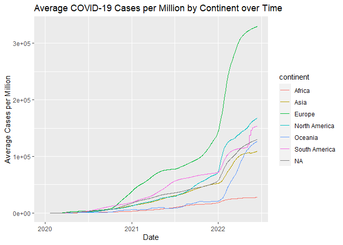<!-- -->

``` r
plots$plot_vaccinations  # Figure 2: Average Fully Vaccinated per Hundred
```

    ## Warning: Removed 2463 rows containing missing values (`geom_line()`).

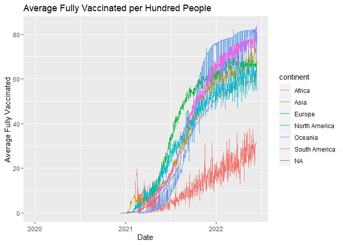<!-- -->

``` r
suppressMessages(Deaths_by_cause <- read_csv("Q1/data/Deaths_by_cause.csv"))
combined_data <- bind_rows(owid_covid_data, Deaths_by_cause)

lowest_le <- combined_data %>%
filter(location %in% c("Chad", "Lesotho", "Central African Republic", "Nigeria", "Sierra Leone"))
Total_Deaths <- lowest_le$total_deaths

source("Q1/code/plot_lowest_le.R")
p <- plot_lowest_le(lowest_le, Total_Deaths, "Total Deaths over Time in Regions with Lowest LE")
p
```

    ## Warning: Removed 213 rows containing missing values (`geom_line()`).

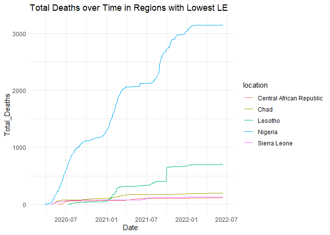<!-- -->

``` r
highest_le <- combined_data %>%
filter(location %in% c("Hong Kong", "Japan", "Macao", "Monaco", "San Marino"))
Total_deaths <- highest_le$total_deaths
q <- plot_lowest_le(highest_le, Total_deaths, "Total Deaths over Time in Regions with Highest LE")
q
```

    ## Warning: Removed 939 rows containing missing values (`geom_line()`).

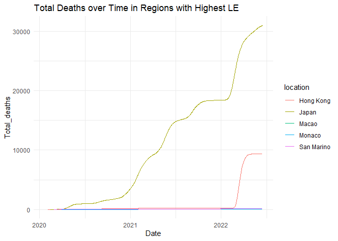<!-- -->

``` r
lowest_le <- combined_data %>%
filter(location %in% c("Chad", "Lesotho", "Central African Republic", "Nigeria", "Sierra Leone"))
Total_Cases_per_Million <- lowest_le$total_cases_per_million
r <- plot_lowest_le(lowest_le, Total_Cases_per_Million, "Total Cases per Million over Time in Regions with Lowest LE")
r
```

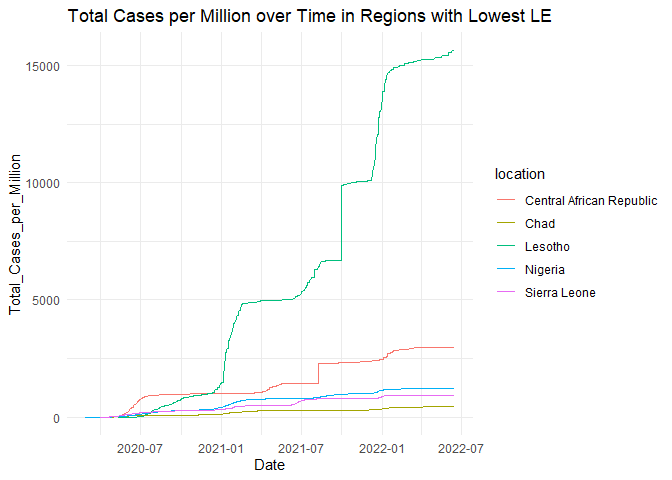<!-- -->

``` r
Total_cases_per_Million <- highest_le$total_cases_per_million

s <- plot_lowest_le(highest_le, Total_cases_per_Million, "Total Cases per Million over Time in Regions with Highest LE")
s
```

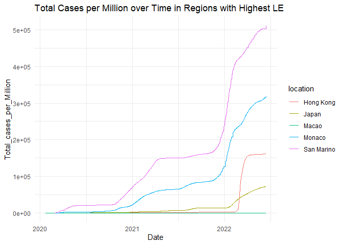<!-- -->

``` r
filtered_data <- combined_data %>%
  filter(continent %in% c("Africa", "North America", "South America", "Asia", "Europe"))
source("Q1/code/plot_filtered_data.R")
hosp <- plot_filtered_data(filtered_data, weekly_hosp_admissions_per_million)
hosp
```

    ## Warning: Removed 157590 rows containing missing values (`geom_bar()`).

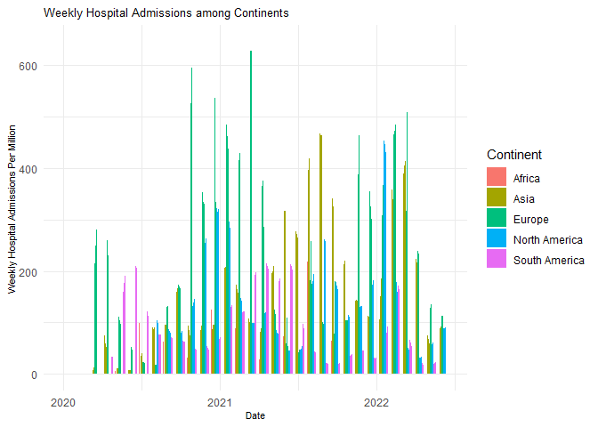<!-- -->

``` r
icu <- plot_filtered_data(filtered_data, weekly_icu_admissions_per_million)
icu
```

    ## Warning: Removed 163863 rows containing missing values (`geom_bar()`).

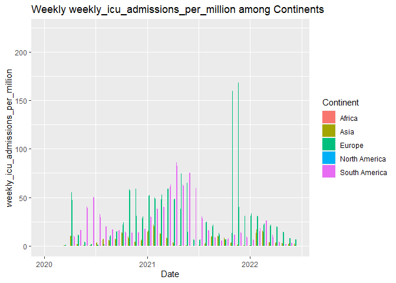<!-- -->

``` r
source("Q1/code/plot_hospital_icu_data.R")


source("Q1/code/plot_hospital_icu_data.R")
globalp <- plot_hospital_icu_data(combined_data, hosp_patients, icu_patients)
globalp
```

    ## Warning: Removed 7332 rows containing missing values (`geom_line()`).

    ## Warning: Removed 8762 rows containing missing values (`geom_line()`).

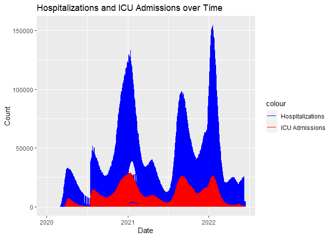<!-- -->

# Question 2

For London

``` r
suppressMessages(london_weather <- read_csv("Q2/data/london_weather.csv"))
london_weather$date <- as.character(london_weather$date)
london_weather$date <- as.Date(london_weather$date, format = "%Y%m%d")
london <- na.omit(london_weather)
london$month <- format(london$date, "%Y-%m")
london_filtered <- london[london$date >= as.Date("2019-01-01"), ]

monthly_precipitation <- london_filtered %>%
  group_by(month) %>%
  summarize(total_precipitation = sum(precipitation, na.rm = TRUE))

monthly_cloudy <- london_filtered %>%
  group_by(month) %>%
  summarize(avg_cloud = mean(cloud_cover, na.rm = TRUE))

monthly_min_temp <- london_filtered %>%
  group_by(month) %>%
  summarize(min_temp = min(min_temp, na.rm = TRUE))

source("Q2/code/plot_monthly_data.R")
precip <- plot_monthly_data(monthly_precipitation, total_precipitation, " Total Precipitation")
precip
```

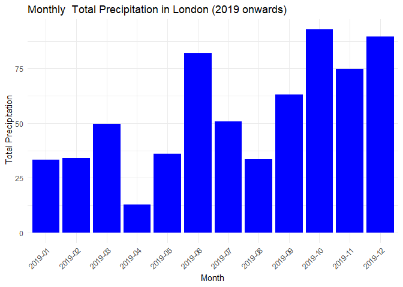<!-- -->

``` r
source("Q2/code/plot_monthly_data.R")
cloud <- plot_monthly_data(monthly_cloudy, avg_cloud, "Average Cloudiness")
cloud
```

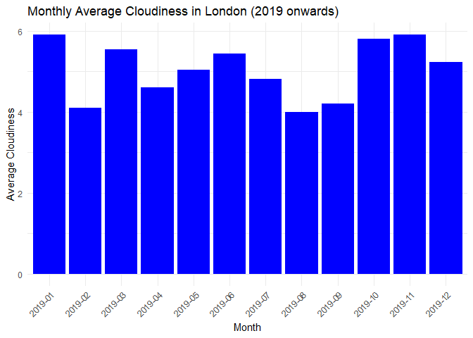<!-- -->

``` r
source("Q2/code/plot_monthly_data.R")
cold <- plot_monthly_data(monthly_min_temp, min_temp, "Average Minimum Temp")
cold
```

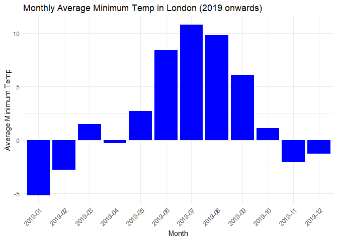<!-- -->

``` r
library(dplyr)
library(knitr)
library(kableExtra)
```

    ## 
    ## Attaching package: 'kableExtra'

    ## The following object is masked from 'package:dplyr':
    ## 
    ##     group_rows

``` r
london$year <- lubridate::year(london$date)
source("Q2/code/generate_summary_stats.R")

summary_stats <- london %>% filter(london$date >= as.Date("2015-01-01"), ) %>%  group_by(year) %>%
  summarize(
    min_temp = min(min_temp, na.rm = TRUE),
    max_temp = max(max_temp, na.rm = TRUE),
    avg_temp = mean(mean_temp, na.rm =TRUE)


  )


kable(summary_stats, caption = "Stats Table", align = "c") %>%
    kable_styling()
```

<table class="table" style="margin-left: auto; margin-right: auto;">
<caption>
Stats Table
</caption>
<thead>
<tr>
<th style="text-align:center;">
year
</th>
<th style="text-align:center;">
min_temp
</th>
<th style="text-align:center;">
max_temp
</th>
<th style="text-align:center;">
avg_temp
</th>
</tr>
</thead>
<tbody>
<tr>
<td style="text-align:center;">
2015
</td>
<td style="text-align:center;">
-5.9
</td>
<td style="text-align:center;">
36.7
</td>
<td style="text-align:center;">
12.13416
</td>
</tr>
<tr>
<td style="text-align:center;">
2016
</td>
<td style="text-align:center;">
-4.6
</td>
<td style="text-align:center;">
33.2
</td>
<td style="text-align:center;">
11.90137
</td>
</tr>
<tr>
<td style="text-align:center;">
2017
</td>
<td style="text-align:center;">
-4.5
</td>
<td style="text-align:center;">
34.5
</td>
<td style="text-align:center;">
12.07750
</td>
</tr>
<tr>
<td style="text-align:center;">
2018
</td>
<td style="text-align:center;">
-5.4
</td>
<td style="text-align:center;">
35.0
</td>
<td style="text-align:center;">
12.52932
</td>
</tr>
<tr>
<td style="text-align:center;">
2019
</td>
<td style="text-align:center;">
-5.2
</td>
<td style="text-align:center;">
37.9
</td>
<td style="text-align:center;">
12.19397
</td>
</tr>
</tbody>
</table>

``` r
source("Q2/code/generate_summary_stats_extra.R")
summary_stats_sun <- london %>% filter(london$date >= as.Date("2015-01-01"), ) %>%  group_by(year) %>%
  summarize(
    sunshine_mean = mean(sunshine, na.rm = TRUE),
    cloud_cover_mean = mean (cloud_cover, na.rm = TRUE),
    precipitation_mean = max(precipitation, na.rm = TRUE)
  )

kable(summary_stats_sun, caption = "Stats Table", align = "c") %>%
    kable_styling()
```

<table class="table" style="margin-left: auto; margin-right: auto;">
<caption>
Stats Table
</caption>
<thead>
<tr>
<th style="text-align:center;">
year
</th>
<th style="text-align:center;">
sunshine_mean
</th>
<th style="text-align:center;">
cloud_cover_mean
</th>
<th style="text-align:center;">
precipitation_mean
</th>
</tr>
</thead>
<tbody>
<tr>
<td style="text-align:center;">
2015
</td>
<td style="text-align:center;">
4.131956
</td>
<td style="text-align:center;">
4.771350
</td>
<td style="text-align:center;">
51.6
</td>
</tr>
<tr>
<td style="text-align:center;">
2016
</td>
<td style="text-align:center;">
4.000822
</td>
<td style="text-align:center;">
5.202740
</td>
<td style="text-align:center;">
27.0
</td>
</tr>
<tr>
<td style="text-align:center;">
2017
</td>
<td style="text-align:center;">
3.853333
</td>
<td style="text-align:center;">
5.361111
</td>
<td style="text-align:center;">
36.8
</td>
</tr>
<tr>
<td style="text-align:center;">
2018
</td>
<td style="text-align:center;">
4.670685
</td>
<td style="text-align:center;">
4.901370
</td>
<td style="text-align:center;">
31.8
</td>
</tr>
<tr>
<td style="text-align:center;">
2019
</td>
<td style="text-align:center;">
4.235890
</td>
<td style="text-align:center;">
5.054794
</td>
<td style="text-align:center;">
31.8
</td>
</tr>
</tbody>
</table>

For the UK in general

``` r
suppressMessages(UK <- read_csv("Q2/data/UKMonthly_Detailed.csv"))
UK$DATE <- as.Date(paste0(UK$DATE, "-01"), format = "%Y-%m-%d")

UK_yearly_temp <- UK %>%
  group_by(year = lubridate::year(DATE)) %>%
  summarize(average_temperature = mean(TAVG, na.rm = TRUE))

source("Q2/code/plot_yearly_data.R")
temp <- plot_yearly_data(UK_yearly_temp, average_temperature, "Average Temperature", "Yearly Average Temperature in UK")
```

    ## Warning: Using `size` aesthetic for lines was deprecated in ggplot2 3.4.0.
    ## ℹ Please use `linewidth` instead.
    ## This warning is displayed once every 8 hours.
    ## Call `lifecycle::last_lifecycle_warnings()` to see where this warning was
    ## generated.

``` r
temp
```

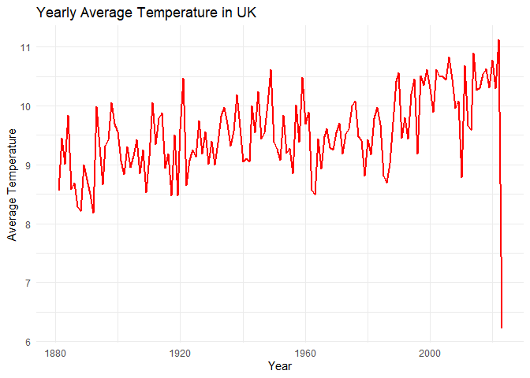<!-- -->

``` r
UK_yearly_heat <- UK %>%
  group_by(year = lubridate::year(DATE)) %>% summarize(average_heat = mean(HTDD, na.rm = TRUE))

heat <- plot_yearly_data(UK_yearly_temp, average_temperature, "Average Number of Heating Days", "Yearly Average Number of Heating Days in UK")
heat
```

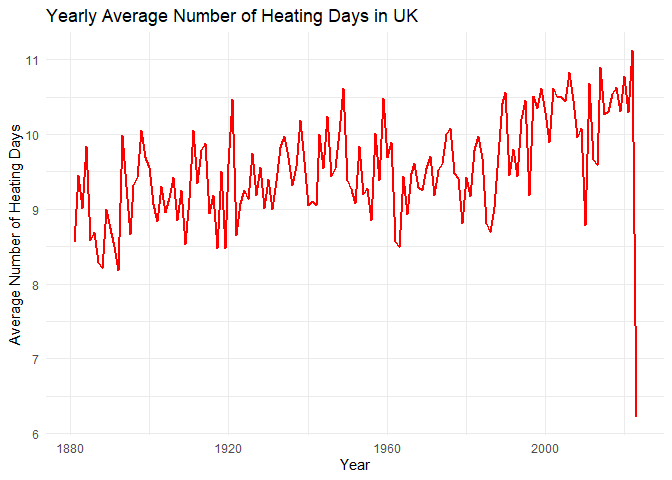<!-- -->

# Question 3

## Coldplay

``` r
suppressMessages(Coldplay <- read_csv("Q3/data/Coldplay.csv"))

filtered_coldplay <- subset(Coldplay, album_name %in% c("Parachutes", "A Rush of Blood to the Head", "X&Y", "Viva La Vida or Death and All His Friends", "Mylo Xyloto", "Ghost Stories", "A Head Full of Dreams", "Love in Tokyo", "Everyday Life", "Music Of The Spheres"))

average_danceability <- aggregate(danceability ~ album_name, data = filtered_coldplay, FUN = mean)

source("Q3/code/plot_average_danceability.R")
dance_coldplay <- plot_average_danceability(average_danceability, album_name)
```

    ## Warning: The `<scale>` argument of `guides()` cannot be `FALSE`. Use "none" instead as
    ## of ggplot2 3.3.4.
    ## This warning is displayed once every 8 hours.
    ## Call `lifecycle::last_lifecycle_warnings()` to see where this warning was
    ## generated.

``` r
dance_coldplay
```

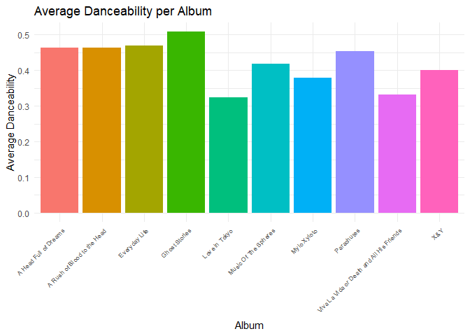<!-- -->

``` r
source("Q3/code/plot_popularity_band.R")
cold_play_plot <- plot_popularity_band(filtered_coldplay, album_name, "Popularity per ColdPlay Album")
cold_play_plot
```

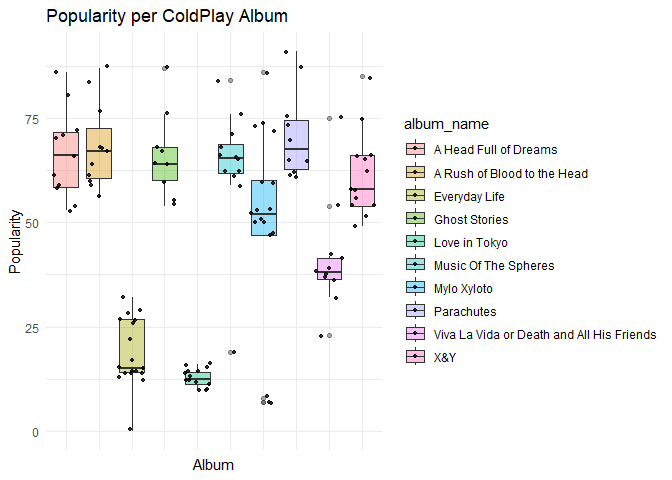<!-- -->

``` r
source("Q3/code/create_corr.R")
col <- create_corr(filtered_coldplay, popularity, danceability, "Correlation between danceability and popularity")
col
```

    ## `geom_smooth()` using formula = 'y ~ x'

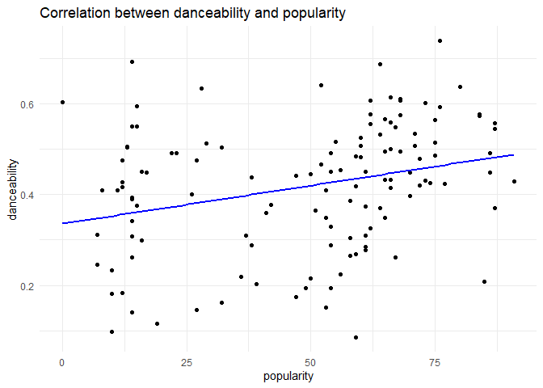<!-- -->

## Metallica

``` r
suppressMessages(metallica <- read.csv("Q3/data/metallica.csv"))
filtered_metallica <- subset(metallica, album %in% c("72 Seasons", "Metallica", "Master Of Puppets (Remastered)", "...And Justice For All", "Kill Em All (Remastered)", "Ride The Lightning (Remastered)", "Death Magnetic", "Garage Inc.", "HardwiredTo Self-Destruct", "Load"))


met_plot <- plot_popularity_band(filtered_metallica, album, "Popularity per Metallica Album")
met_plot
```

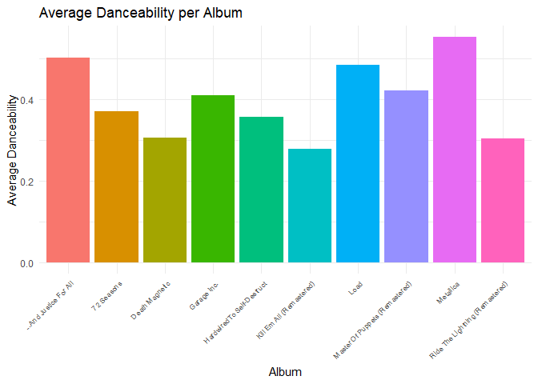<!-- -->

# Question 4

``` r
library(knitr)
library(kableExtra)

suppressMessages(titles <- read_csv("Q4_informal/data/titles.csv"))
suppressMessages(credits <- read_csv("Q4_informal/data/credits.csv"))
merged_data <- merge(titles, credits, by = "id", all.x = TRUE)

source("Q4_informal/code/calculate_actor_frequency.R")
actor_frequency <- calculate_actor_frequency(merged_data)

table <- kable(actor_frequency, row.names = TRUE,
      caption = 'Top Actors on Netflix by IMDB Score and their Frequency in Netflix titles',
      format = "html", booktabs = T) %>%
        kable_styling(full_width = T,
                      latex_options = c("striped",
                                        "scale_down",
                                        "HOLD_position"),
                      font_size = 13)
table
```

<table class="table" style="font-size: 13px; margin-left: auto; margin-right: auto;">
<caption style="font-size: initial !important;">
Top Actors on Netflix by IMDB Score and their Frequency in Netflix
titles
</caption>
<thead>
<tr>
<th style="text-align:left;">
</th>
<th style="text-align:left;">
Actor
</th>
<th style="text-align:right;">
Frequency
</th>
</tr>
</thead>
<tbody>
<tr>
<td style="text-align:left;">
1
</td>
<td style="text-align:left;">
André Sogliuzzo
</td>
<td style="text-align:right;">
2
</td>
</tr>
<tr>
<td style="text-align:left;">
2
</td>
<td style="text-align:left;">
Anna Gunn
</td>
<td style="text-align:right;">
1
</td>
</tr>
<tr>
<td style="text-align:left;">
3
</td>
<td style="text-align:left;">
Betsy Brandt
</td>
<td style="text-align:right;">
1
</td>
</tr>
<tr>
<td style="text-align:left;">
4
</td>
<td style="text-align:left;">
Bob Odenkirk
</td>
<td style="text-align:right;">
5
</td>
</tr>
<tr>
<td style="text-align:left;">
5
</td>
<td style="text-align:left;">
Bryan Cranston
</td>
<td style="text-align:right;">
9
</td>
</tr>
<tr>
<td style="text-align:left;">
6
</td>
<td style="text-align:left;">
Cricket Leigh
</td>
<td style="text-align:right;">
1
</td>
</tr>
<tr>
<td style="text-align:left;">
7
</td>
<td style="text-align:left;">
David Attenborough
</td>
<td style="text-align:right;">
5
</td>
</tr>
<tr>
<td style="text-align:left;">
8
</td>
<td style="text-align:left;">
Dean Norris
</td>
<td style="text-align:right;">
11
</td>
</tr>
<tr>
<td style="text-align:left;">
9
</td>
<td style="text-align:left;">
Dee Bradley Baker
</td>
<td style="text-align:right;">
13
</td>
</tr>
<tr>
<td style="text-align:left;">
10
</td>
<td style="text-align:left;">
Greg Baldwin
</td>
<td style="text-align:right;">
4
</td>
</tr>
<tr>
<td style="text-align:left;">
11
</td>
<td style="text-align:left;">
Grey DeLisle
</td>
<td style="text-align:right;">
14
</td>
</tr>
<tr>
<td style="text-align:left;">
12
</td>
<td style="text-align:left;">
Jack De Sena
</td>
<td style="text-align:right;">
2
</td>
</tr>
<tr>
<td style="text-align:left;">
13
</td>
<td style="text-align:left;">
Jessie Flower
</td>
<td style="text-align:right;">
1
</td>
</tr>
<tr>
<td style="text-align:left;">
14
</td>
<td style="text-align:left;">
Jonathan Banks
</td>
<td style="text-align:right;">
8
</td>
</tr>
<tr>
<td style="text-align:left;">
15
</td>
<td style="text-align:left;">
Mae Whitman
</td>
<td style="text-align:right;">
3
</td>
</tr>
<tr>
<td style="text-align:left;">
16
</td>
<td style="text-align:left;">
Mayur More
</td>
<td style="text-align:right;">
3
</td>
</tr>
<tr>
<td style="text-align:left;">
17
</td>
<td style="text-align:left;">
Zach Tyler
</td>
<td style="text-align:right;">
1
</td>
</tr>
</tbody>
</table>

``` r
source("Q4_informal/code/genre_plot.R")
genre <- genre_plot(merged_data)
genre
```

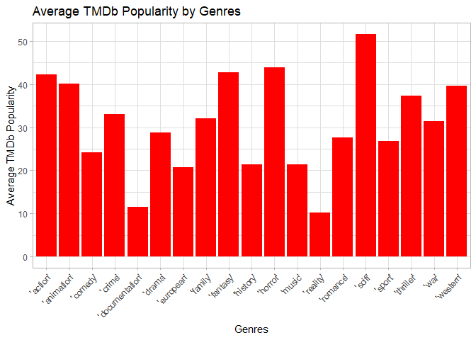<!-- -->

``` r
source("Q4_informal/code/plot_runtime_distribution.R")
dist_movie <- plot_runtime_distribution(merged_data, "MOVIE")
```

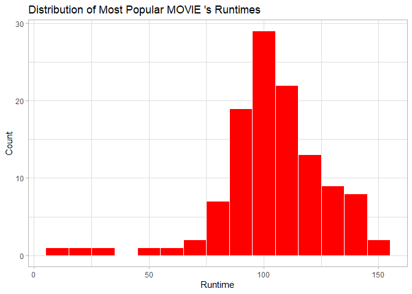<!-- -->

``` r
#dist_movie

dist_series <- plot_runtime_distribution(merged_data, "SHOW")
```

<!-- -->

``` r
#dist_series
```
