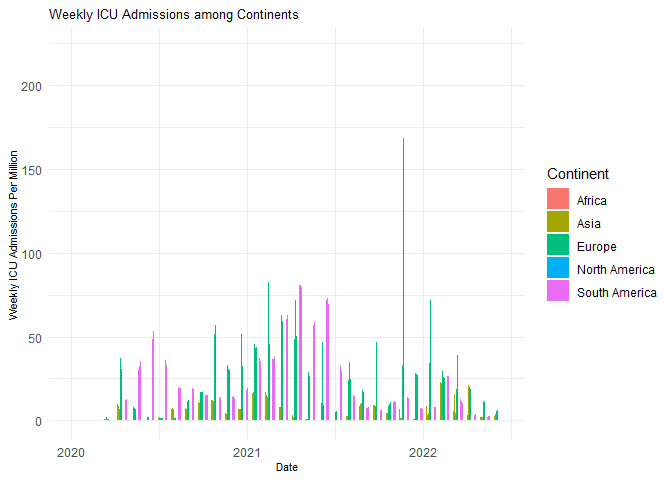
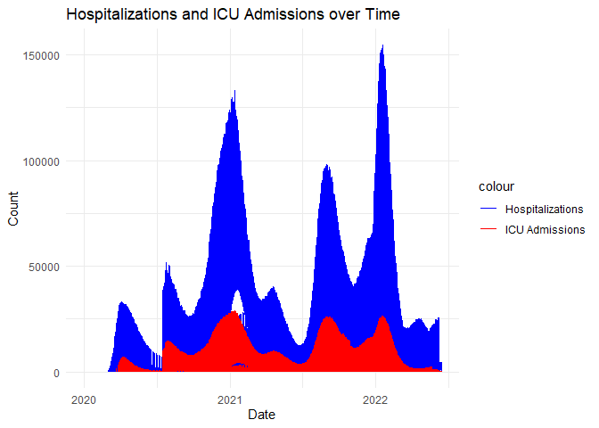

# Hannah’s Data Science Exam

The purpose of this ReadMe is to show my output and thinking from each
question.

``` r
rm(list = ls()) # Clean your environment:
gc() # garbage collection - It can be useful to call gc after a large object has been removed, as this may prompt R to return memory to the operating system.
```

    ##          used (Mb) gc trigger (Mb) max used (Mb)
    ## Ncells 466554 25.0    1002817 53.6   660388 35.3
    ## Vcells 863606  6.6    8388608 64.0  1769776 13.6

``` r
suppressMessages(library(tidyverse))
suppressMessages(list.files('code/', full.names = T, recursive = T) %>% .[grepl('.R', .)] %>% as.list() %>% walk(~source(.)))


# Texevier::create_template(directory = "C:/Users/hanna/OneDrive/Documents/Data Science/21082022/",
#                           template_name = "Q3_formal",
#                            build_project = T, open_project = T)
# # 
# # 
# Texevier::create_template_html(directory = "C:/Users/hanna/OneDrive/Documents/Data Science/21082022/",
#                         template_name = "Q3",
#                         build_project = T, open_project = T)
```

# Question 1

Read in data and source functions

``` r
owid_covid_data <- read_csv("Q1/data/owid-covid-data.csv")
```

    ## Rows: 194260 Columns: 67
    ## ── Column specification ────────────────────────────────────────────────────────
    ## Delimiter: ","
    ## chr   (4): iso_code, continent, location, tests_units
    ## dbl  (62): total_cases, new_cases, new_cases_smoothed, total_deaths, new_dea...
    ## date  (1): date
    ## 
    ## ℹ Use `spec()` to retrieve the full column specification for this data.
    ## ℹ Specify the column types or set `show_col_types = FALSE` to quiet this message.

``` r
source("Q1/code/plot_covid_and_vaccination.R")
plots <- plot_covid_and_vaccination(owid_covid_data)
```

    ## `summarise()` has grouped output by 'date'. You can override using the
    ## `.groups` argument.
    ## `summarise()` has grouped output by 'date'. You can override using the
    ## `.groups` argument.

``` r
plots$plot_cases  # Figure 1: Average COVID-19 Cases per Million by Continent over Time
```

    ## Warning: Removed 101 rows containing missing values (`geom_line()`).

<!-- -->

``` r
plots$plot_vaccinations  # Figure 2: Average Fully Vaccinated per Hundred
```

    ## Warning: Removed 2463 rows containing missing values (`geom_line()`).

<!-- -->

``` r
Deaths_by_cause <- read_csv("Q1/data/Deaths_by_cause.csv")
```

    ## Rows: 7273 Columns: 36
    ## ── Column specification ────────────────────────────────────────────────────────
    ## Delimiter: ","
    ## chr  (3): Entity, Code, Number of executions (Amnesty International)
    ## dbl (33): Year, Deaths - Meningitis - Sex: Both - Age: All Ages (Number), De...
    ## 
    ## ℹ Use `spec()` to retrieve the full column specification for this data.
    ## ℹ Specify the column types or set `show_col_types = FALSE` to quiet this message.

``` r
combined_data <- bind_rows(owid_covid_data, Deaths_by_cause)

lowest_le <- combined_data %>%
filter(location %in% c("Chad", "Lesotho", "Central African Republic", "Nigeria", "Sierra Leone"))
Total_Deaths <- lowest_le$total_deaths

source("Q1/code/plot_lowest_le.R")
p <- plot_lowest_le(lowest_le, Total_Deaths, "Total Deaths over Time in Regions with Lowest LE")
p
```

    ## Warning: Removed 213 rows containing missing values (`geom_line()`).

<!-- -->

``` r
highest_le <- combined_data %>%
filter(location %in% c("Hong Kong", "Japan", "Macao", "Monaco", "San Marino"))
Total_deaths <- highest_le$total_deaths
q <- plot_lowest_le(highest_le, Total_deaths, "Total Deaths over Time in Regions with Highest LE")
q
```

    ## Warning: Removed 939 rows containing missing values (`geom_line()`).

<!-- -->

``` r
lowest_le <- combined_data %>%
filter(location %in% c("Chad", "Lesotho", "Central African Republic", "Nigeria", "Sierra Leone"))
Total_Cases_per_Million <- lowest_le$total_cases_per_million
r <- plot_lowest_le(lowest_le, Total_Cases_per_Million, "Total Cases per Million over Time in Regions with Lowest LE")
r
```

<!-- -->

``` r
Total_cases_per_Million <- highest_le$total_cases_per_million

s <- plot_lowest_le(highest_le, Total_cases_per_Million, "Total Cases per Million over Time in Regions with Highest LE")
s
```

<!-- -->

``` r
filtered_data <- combined_data %>%
  filter(continent %in% c("Africa", "North America", "South America", "Asia", "Europe"))
source("Q1/code/plot_filtered_data.R")
hosp <- plot_filtered_data(filtered_data, weekly_hosp_admissions_per_million)
hosp
```

    ## Warning: Removed 157590 rows containing missing values (`geom_bar()`).

<!-- -->

``` r
icu <- plot_filtered_data(filtered_data, weekly_icu_admissions_per_million)
icu
```

    ## Warning: Removed 163863 rows containing missing values (`geom_bar()`).

<!-- -->

``` r
source("Q1/code/plot_hospital_icu_data.R")


source("Q1/code/plot_hospital_icu_data.R")
globalp <- plot_hospital_icu_data(combined_data, hosp_patients, icu_patients)
globalp
```

    ## Warning: Removed 7332 rows containing missing values (`geom_line()`).

    ## Warning: Removed 8762 rows containing missing values (`geom_line()`).

<!-- -->

# Question 2

For London

``` r
london_weather <- read_csv("Q2/data/london_weather.csv")
```

    ## Rows: 15341 Columns: 10
    ## ── Column specification ────────────────────────────────────────────────────────
    ## Delimiter: ","
    ## dbl (10): date, cloud_cover, sunshine, global_radiation, max_temp, mean_temp...
    ## 
    ## ℹ Use `spec()` to retrieve the full column specification for this data.
    ## ℹ Specify the column types or set `show_col_types = FALSE` to quiet this message.

``` r
london_weather$date <- as.character(london_weather$date)
london_weather$date <- as.Date(london_weather$date, format = "%Y%m%d")
london <- na.omit(london_weather)
london$month <- format(london$date, "%Y-%m")
london_filtered <- london[london$date >= as.Date("2019-01-01"), ]

monthly_precipitation <- london_filtered %>%
  group_by(month) %>%
  summarize(total_precipitation = sum(precipitation, na.rm = TRUE))

monthly_cloudy <- london_filtered %>%
  group_by(month) %>%
  summarize(avg_cloud = mean(cloud_cover, na.rm = TRUE))

monthly_min_temp <- london_filtered %>%
  group_by(month) %>%
  summarize(min_temp = min(min_temp, na.rm = TRUE))

source("Q2/code/plot_monthly_data.R")
precip <- plot_monthly_data(monthly_precipitation, total_precipitation, " Total Precipitation")
precip
```

<!-- -->

``` r
source("Q2/code/plot_monthly_data.R")
cloud <- plot_monthly_data(monthly_cloudy, avg_cloud, "Average Cloudiness")
cloud
```

<!-- -->

``` r
source("Q2/code/plot_monthly_data.R")
cold <- plot_monthly_data(monthly_min_temp, min_temp, "Average Minimum Temp")
cold
```

<!-- -->

``` r
library(dplyr)
library(knitr)
library(kableExtra)
```

    ## 
    ## Attaching package: 'kableExtra'

    ## The following object is masked from 'package:dplyr':
    ## 
    ##     group_rows

``` r
london$year <- lubridate::year(london$date)
source("Q2/code/generate_summary_stats.R")

summary_stats <- london %>% filter(london$date >= as.Date("2015-01-01"), ) %>%  group_by(year) %>%
  summarize(
    min_temp = min(min_temp, na.rm = TRUE),
    max_temp = max(max_temp, na.rm = TRUE),
    avg_temp = mean(mean_temp, na.rm =TRUE)


  )


kable(summary_stats, caption = "Stats Table", align = "c") %>%
    kable_styling()
```

<table class="table" style="margin-left: auto; margin-right: auto;">
<caption>
Stats Table
</caption>
<thead>
<tr>
<th style="text-align:center;">
year
</th>
<th style="text-align:center;">
min_temp
</th>
<th style="text-align:center;">
max_temp
</th>
<th style="text-align:center;">
avg_temp
</th>
</tr>
</thead>
<tbody>
<tr>
<td style="text-align:center;">
2015
</td>
<td style="text-align:center;">
-5.9
</td>
<td style="text-align:center;">
36.7
</td>
<td style="text-align:center;">
12.13416
</td>
</tr>
<tr>
<td style="text-align:center;">
2016
</td>
<td style="text-align:center;">
-4.6
</td>
<td style="text-align:center;">
33.2
</td>
<td style="text-align:center;">
11.90137
</td>
</tr>
<tr>
<td style="text-align:center;">
2017
</td>
<td style="text-align:center;">
-4.5
</td>
<td style="text-align:center;">
34.5
</td>
<td style="text-align:center;">
12.07750
</td>
</tr>
<tr>
<td style="text-align:center;">
2018
</td>
<td style="text-align:center;">
-5.4
</td>
<td style="text-align:center;">
35.0
</td>
<td style="text-align:center;">
12.52932
</td>
</tr>
<tr>
<td style="text-align:center;">
2019
</td>
<td style="text-align:center;">
-5.2
</td>
<td style="text-align:center;">
37.9
</td>
<td style="text-align:center;">
12.19397
</td>
</tr>
</tbody>
</table>

``` r
source("Q2/code/generate_summary_stats_extra.R")
summary_stats_sun <- london %>% filter(london$date >= as.Date("2015-01-01"), ) %>%  group_by(year) %>%
  summarize(
    sunshine_mean = mean(sunshine, na.rm = TRUE),
    cloud_cover_mean = mean (cloud_cover, na.rm = TRUE),
    precipitation_mean = max(precipitation, na.rm = TRUE)
  )

kable(summary_stats_sun, caption = "Stats Table", align = "c") %>%
    kable_styling()
```

<table class="table" style="margin-left: auto; margin-right: auto;">
<caption>
Stats Table
</caption>
<thead>
<tr>
<th style="text-align:center;">
year
</th>
<th style="text-align:center;">
sunshine_mean
</th>
<th style="text-align:center;">
cloud_cover_mean
</th>
<th style="text-align:center;">
precipitation_mean
</th>
</tr>
</thead>
<tbody>
<tr>
<td style="text-align:center;">
2015
</td>
<td style="text-align:center;">
4.131956
</td>
<td style="text-align:center;">
4.771350
</td>
<td style="text-align:center;">
51.6
</td>
</tr>
<tr>
<td style="text-align:center;">
2016
</td>
<td style="text-align:center;">
4.000822
</td>
<td style="text-align:center;">
5.202740
</td>
<td style="text-align:center;">
27.0
</td>
</tr>
<tr>
<td style="text-align:center;">
2017
</td>
<td style="text-align:center;">
3.853333
</td>
<td style="text-align:center;">
5.361111
</td>
<td style="text-align:center;">
36.8
</td>
</tr>
<tr>
<td style="text-align:center;">
2018
</td>
<td style="text-align:center;">
4.670685
</td>
<td style="text-align:center;">
4.901370
</td>
<td style="text-align:center;">
31.8
</td>
</tr>
<tr>
<td style="text-align:center;">
2019
</td>
<td style="text-align:center;">
4.235890
</td>
<td style="text-align:center;">
5.054794
</td>
<td style="text-align:center;">
31.8
</td>
</tr>
</tbody>
</table>

For the UK in general

``` r
UK <- read_csv("Q2/data/UKMonthly_Detailed.csv")
```

    ## Rows: 1707 Columns: 34
    ## ── Column specification ────────────────────────────────────────────────────────
    ## Delimiter: ","
    ## chr (17): STATION, DATE, NAME, CDSD_ATTRIBUTES, CLDD_ATTRIBUTES, DT00_ATTRIB...
    ## dbl (17): LATITUDE, LONGITUDE, ELEVATION, CDSD, CLDD, DT00, DT32, DX32, DX70...
    ## 
    ## ℹ Use `spec()` to retrieve the full column specification for this data.
    ## ℹ Specify the column types or set `show_col_types = FALSE` to quiet this message.

``` r
UK$DATE <- as.Date(paste0(UK$DATE, "-01"), format = "%Y-%m-%d")

UK_yearly_temp <- UK %>%
  group_by(year = lubridate::year(DATE)) %>%
  summarize(average_temperature = mean(TAVG, na.rm = TRUE))

source("Q2/code/plot_yearly_data.R")
temp <- plot_yearly_data(UK_yearly_temp, average_temperature, "Average Temperature", "Yearly Average Temperature in UK")
```

    ## Warning: Using `size` aesthetic for lines was deprecated in ggplot2 3.4.0.
    ## ℹ Please use `linewidth` instead.
    ## This warning is displayed once every 8 hours.
    ## Call `lifecycle::last_lifecycle_warnings()` to see where this warning was
    ## generated.

``` r
temp
```

<!-- -->

``` r
UK_yearly_heat <- UK %>%
  group_by(year = lubridate::year(DATE)) %>% summarize(average_heat = mean(HTDD, na.rm = TRUE))

heat <- plot_yearly_data(UK_yearly_temp, average_temperature, "Average Number of Heating Days", "Yearly Average Number of Heating Days in UK")
heat
```

<!-- -->
