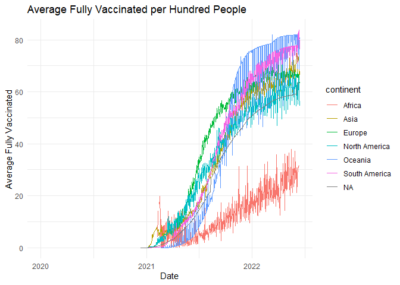

# Hannah’s Data Science Exam

The purpose of this ReadMe is to show my output and thinking from each
question.

``` r
rm(list = ls()) # Clean your environment:
gc() # garbage collection - It can be useful to call gc after a large object has been removed, as this may prompt R to return memory to the operating system.
```

    ##          used (Mb) gc trigger (Mb) max used (Mb)
    ## Ncells 466413 25.0    1002414 53.6   660388 35.3
    ## Vcells 862602  6.6    8388608 64.0  1769776 13.6

``` r
suppressMessages(library(tidyverse))
suppressMessages(list.files('code/', full.names = T, recursive = T) %>% .[grepl('.R', .)] %>% as.list() %>% walk(~source(.)))


# Texevier::create_template(directory = "C:/Users/hanna/OneDrive/Documents/Data Science/21082022/",
#                           template_name = "Q3_formal",
#                            build_project = T, open_project = T)
# # 
# # 
# Texevier::create_template_html(directory = "C:/Users/hanna/OneDrive/Documents/Data Science/21082022/",
#                         template_name = "Q3",
#                         build_project = T, open_project = T)
```

# Question 1

Read in data and source functions

``` r
owid_covid_data <- read_csv("Q1/data/owid-covid-data.csv")
```

    ## Rows: 194260 Columns: 67
    ## ── Column specification ────────────────────────────────────────────────────────
    ## Delimiter: ","
    ## chr   (4): iso_code, continent, location, tests_units
    ## dbl  (62): total_cases, new_cases, new_cases_smoothed, total_deaths, new_dea...
    ## date  (1): date
    ## 
    ## ℹ Use `spec()` to retrieve the full column specification for this data.
    ## ℹ Specify the column types or set `show_col_types = FALSE` to quiet this message.

``` r
source("Q1/code/plot_covid_and_vaccination.R")
plots <- plot_covid_and_vaccination(owid_covid_data)
```

    ## `summarise()` has grouped output by 'date'. You can override using the
    ## `.groups` argument.
    ## `summarise()` has grouped output by 'date'. You can override using the
    ## `.groups` argument.

``` r
plots$plot_cases  # Figure 1: Average COVID-19 Cases per Million by Continent over Time
```

    ## Warning: Removed 101 rows containing missing values (`geom_line()`).

<!-- -->

``` r
plots$plot_vaccinations  # Figure 2: Average Fully Vaccinated per Hundred
```

    ## Warning: Removed 2463 rows containing missing values (`geom_line()`).

<!-- -->

``` r
Deaths_by_cause <- read_csv("Q1/data/Deaths_by_cause.csv")
```

    ## Rows: 7273 Columns: 36
    ## ── Column specification ────────────────────────────────────────────────────────
    ## Delimiter: ","
    ## chr  (3): Entity, Code, Number of executions (Amnesty International)
    ## dbl (33): Year, Deaths - Meningitis - Sex: Both - Age: All Ages (Number), De...
    ## 
    ## ℹ Use `spec()` to retrieve the full column specification for this data.
    ## ℹ Specify the column types or set `show_col_types = FALSE` to quiet this message.

``` r
combined_data <- bind_rows(owid_covid_data, Deaths_by_cause)

lowest_le <- combined_data %>%
filter(location %in% c("Chad", "Lesotho", "Central African Republic", "Nigeria", "Sierra Leone"))
Total_Deaths <- lowest_le$total_deaths

source("Q1/code/plot_lowest_le.R")
p <- plot_lowest_le(lowest_le, Total_Deaths, "Total Deaths over Time in Regions with Lowest LE")
p
```

    ## Warning: Removed 213 rows containing missing values (`geom_line()`).

<!-- -->

``` r
highest_le <- combined_data %>%
filter(location %in% c("Hong Kong", "Japan", "Macao", "Monaco", "San Marino"))
Total_deaths <- highest_le$total_deaths
q <- plot_lowest_le(highest_le, Total_deaths, "Total Deaths over Time in Regions with Highest LE")
q
```

    ## Warning: Removed 939 rows containing missing values (`geom_line()`).

<!-- -->

``` r
lowest_le <- combined_data %>%
filter(location %in% c("Chad", "Lesotho", "Central African Republic", "Nigeria", "Sierra Leone"))
Total_Cases_per_Million <- lowest_le$total_cases_per_million
r <- plot_lowest_le(lowest_le, Total_Cases_per_Million, "Total Cases per Million over Time in Regions with Lowest LE")
r
```

<!-- -->

``` r
Total_cases_per_Million <- highest_le$total_cases_per_million

s <- plot_lowest_le(highest_le, Total_cases_per_Million, "Total Cases per Million over Time in Regions with Highest LE")
s
```

<!-- -->
